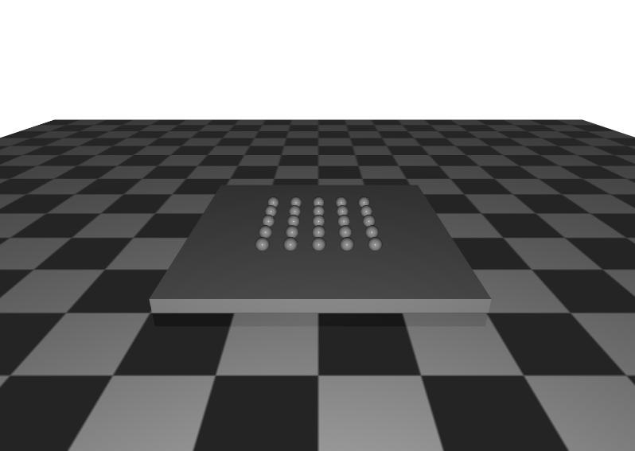

# Rolling test 

<!---

--->

  <iframe src="https://www.youtube.com/embed/5wcjoc7NRmk?rel=0&amp;controls=0&amp;showinfo=0" frameborder="0" allow="autoplay; encrypted-media" allowfullscreen
    style="position:absolute;top:0;left:0;width:100%;height:100%;"></iframe>

Rolling test is for testing frictional contact behavior. The error is measured by comparing the simulation with analytical solution.
The test focuses on:

1. Frictional cone (diagonal, elliptic)
2. The accuracy of frictional contact simulation
3. The violation of hard-contact constraint (penetration)
4. The effect of ERP (error-correcting)

## Test scenario 

- static ground
- 10 kg box on the ground
- 25 number of 1 kg balls on the box
- the friction coefficient 
    - 0.8 for ball-box pair
    - 0.4 for box-ground pari
- 150 N force applied to box in the xy direction  
- no error correcting (ERP)

## Tested solver list

- Rai 
    - Bisection solver (Rai solver)
- Bullet
    - Sequence impulse 
    - NNCG
    - MLCP Dantzig
    - MLCP PGS
- ODE
    - Quick
- MuJoCo
    - PGS
    - CG
    - Newton 
- Dart
    - Dantzig
    - PGS

Note that ODE standard solver fails without ERP, the box goes into the ground as [this video](https://youtu.be/ifO2gtINIzU).

## Results

The pushing force resulted in no motion in ODE and Dart as the following video.

  <iframe src="https://www.youtube.com/embed/Jrhxo_yocVE?rel=0&amp;controls=0&amp;showinfo=0" frameborder="0" allow="autoplay; encrypted-media" allowfullscreen
    style="position:absolute;top:0;left:0;width:100%;height:100%;"></iframe>

However as the force is applied to y direction, the objects move. This is due to the pyramid shaped friction cone.   

  <iframe src="https://www.youtube.com/embed/0nW6O5q8Z0Q?rel=0&amp;controls=0&amp;showinfo=0" frameborder="0" allow="autoplay; encrypted-media" allowfullscreen
    style="position:absolute;top:0;left:0;width:100%;height:100%;"></iframe>

The objects oscillates significantly in MuJoCo as the time step size increases. It leads to inaccurate solution. 

  <iframe src="https://www.youtube.com/embed/OLvkfdO9SzA?rel=0&amp;controls=0&amp;showinfo=0" frameborder="0" allow="autoplay; encrypted-media" allowfullscreen
    style="position:absolute;top:0;left:0;width:100%;height:100%;"></iframe>

Besides, Bullet and Rai are stable, accurate and fast as the following figure.  

<!---
#### With ERP

#### Without ERP

## Force along Y-direction 

#### With ERP

#### Without ERP

--->